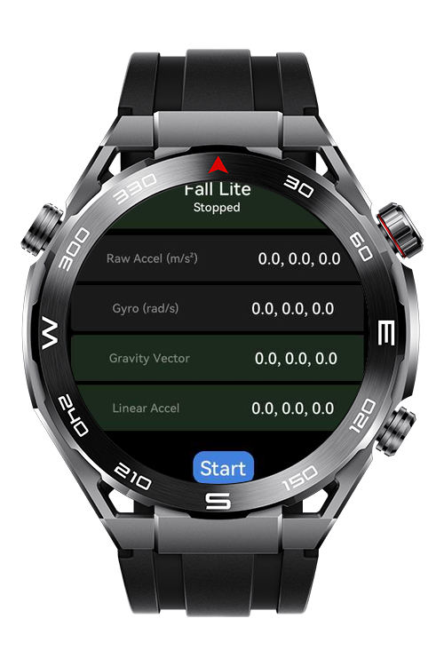
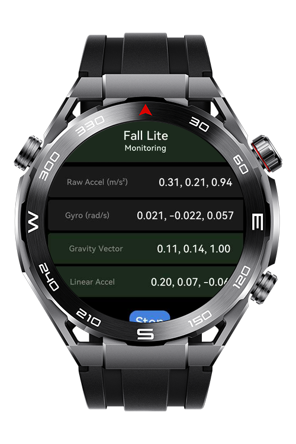
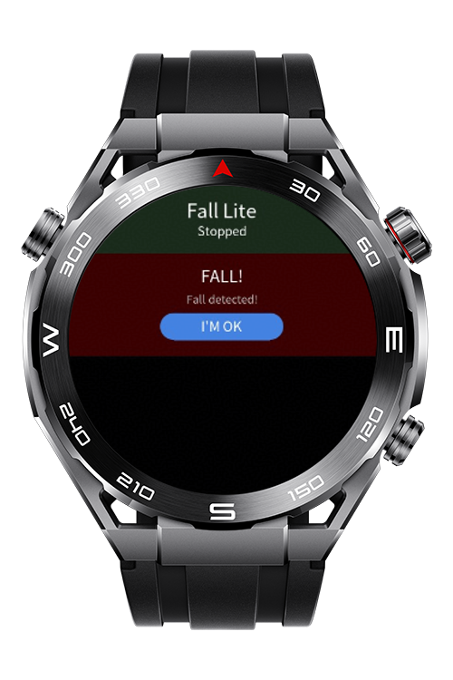

> **Note:** To access all shared projects, get information about environment setup, and view other guides, please visit [Explore-In-HMOS-Wearable Index](https://github.com/Explore-In-HMOS-Wearable/hmos-index).

# How to Derive Linear Acceleration from Accelerometer and Gyroscope on Lite Wearable

**How to Derive Linear Acceleration from Accelerometer and Gyroscope on Lite Wearable** is a lite wearable application that monitors accelerometer and gyroscope data to detect potential fall events.
It provides real-time sensor monitoring, configurable detection thresholds, a mock simulation mode for testing, and a fall history log.

# Preview
<div>
  
  
  
</div>

# Use Cases
- Start / Stop Fall Monitoring
- View live sensor values (Accelerometer / Gyroscope)
- Detect falls and show an alert screen

# Technology
## Stack
**Languages**: JS

**Frameworks**: HarmonyOS SDK 4.0.0(10)

**Tools**: DevEco Studio 6.1.1

**Libraries/Kits**: 
  - @system.vibrator 
  - @system.sensor

# Directory Structure
```
entry\src\main\js
└───MainAbility
    │   app.js
    └───pages
        ├───index
        │      index.css
        │      index.hml
        └──────index.js
```

# Constraints and Restrictions
## Supported Device
- Huawei Sport (Lite) Watch GT 4/5/6
- Huawei Sport (Lite) GT4/5 Pro
- Huawei Sport (Lite) Fit 3/4
- Huawei Sport (Lite) D2
- Huawei Sport (Lite) Ultimate
# License
**How to Derive Linear Acceleration from Accelerometer and Gyroscope on Lite Wearable** is distributed under the terms of the MIT License
See the [LICENSE](./LICENSE) for more information.
